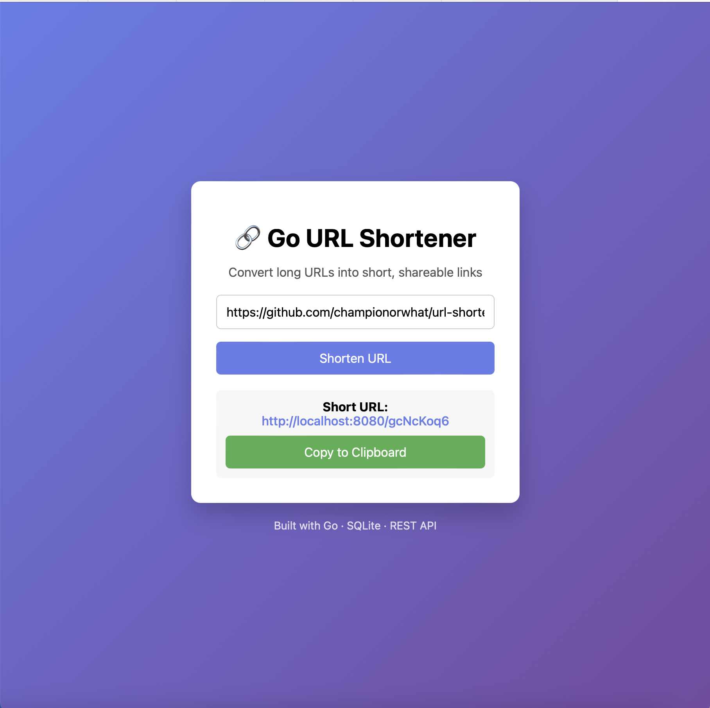

# 🔗 Go URL Shortener

A full-stack URL shortener application built using **Go** with a clean backend architecture and a modern, lightweight frontend.  
It converts long URLs into short, shareable links with persistent storage.

---

## 🚀 Features

- Shorten long URLs into unique short links
- Redirect short URLs to the original destination
- Persistent storage using SQLite
- RESTful API built with Go
- Clean layered architecture (handler, service, repository)
- CORS-enabled backend
- Modern frontend UI for easy testing
- Copy-to-clipboard support
- Docker-ready backend

---

## 🖥️ Demo



---

## 🛠️ Tech Stack

### Backend
- Go
- Gorilla Mux
- SQLite
- REST API
- Clean Architecture

### Frontend
- HTML
- CSS
- Vanilla JavaScript (Fetch API)

---

## 📂 Project Structure

```text
url-shortener/
├── cmd/
│   └── server/
│       └── main.go
├── internal/
│   ├── handler/
│   ├── service/
│   ├── repository/
│   ├── model/
│   └── middleware/
│       ├── cors.go
│       └── logger.go
├── migrations/
│   └── schema.sql
├── frontend/
│   ├── index.html
│   ├── style.css
│   └── script.js
├── screenshots/
│   └── demo.png
├── Dockerfile
├── go.mod
├── go.sum
├── README.md
└── .gitignore


## ▶️ Running the Project Locally
```1️⃣ Start the Backend
go run cmd/server/main.go
Backend runs at:
http://localhost:8080
Health check:
curl http://localhost:8080/health```
2️⃣ Start the Frontend
```cd frontend
python3 -m http.server 5500
Open in browser:
http://localhost:5500```
## 🔌 API Endpoints
➕ Shorten URL
POST /api/shorten
```Request Body
{
  "url": "https://www.google.com"
}```
```Response
{
  "id": 1,
  "short_code": "gcNcKoq6",
  "original_url": "https://www.google.com",
  "created_at": "2025-12-19T18:00:58Z"
}```
🔁 Redirect
GET /{short_code}
```Example:
http://localhost:8080/gcNcKoq6```
Redirects to the original URL.
🧪 Example cURL Request
```curl -X POST http://localhost:8080/api/shorten \
  -H "Content-Type: application/json" \
  -d '{"url":"https://www.google.com"}'```
## 🐳 Docker Support
Build and run the backend using Docker:
```docker build -t go-url-shortener .
docker run -p 8080:8080 go-url-shortener```
## 🎯 Learning Outcomes
Building REST APIs in Go
Applying clean architecture principles
SQLite database integration
Proper CORS handling
Frontend–backend integration
Debugging real-world issues (Git, Docker, CORS)
Writing production-quality documentation
## 📌 Future Enhancements
Click analytics
URL expiration
Custom aliases
Authentication
Cloud deployment
## 👤 Author
Pratibimb Gupta
Built as a hands-on Go backend learning project.